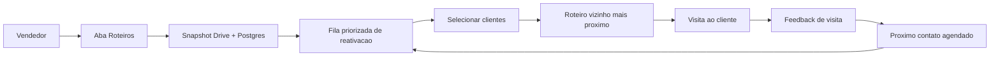
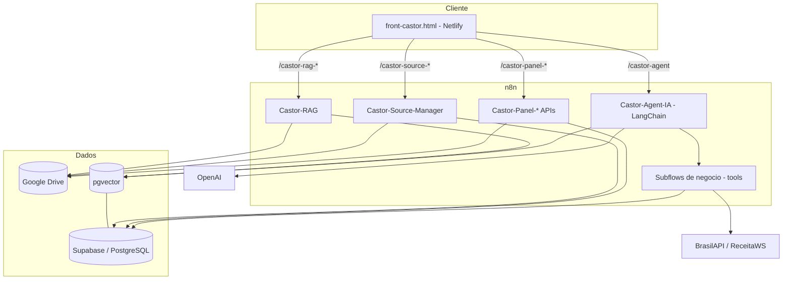
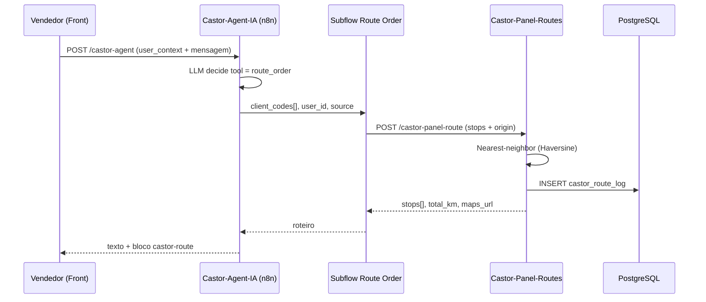
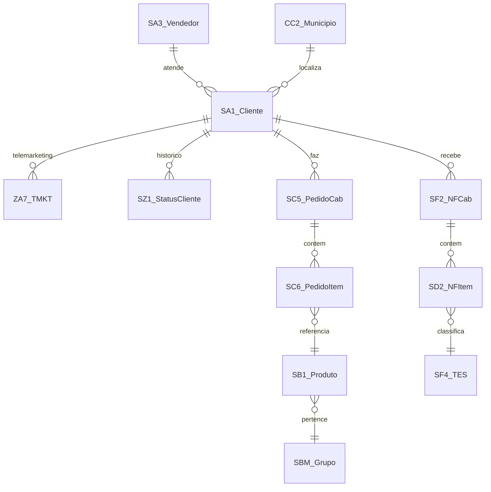

# Castor — Copiloto Comercial B2B

Documentação Completa de Negócio e Técnica

Projeto de IA na Indústria — Parceria SENAI

---

## Sumário Executivo

O **Castor** é um **copiloto comercial baseado em IA** que apoia os representantes de vendas da **Castor (distribuidora B2B)** em duas missões: **reativar clientes inativos** e **prospectar novos leads**. Ele combina um agente conversacional (chat) com um painel operacional de **roteirização de visitas**, **CRM leve** (follow-ups e feedback de visita) e **análise de produtos/faturamento**.

O sistema lê dados do ERP **TOTVS Protheus** (filial 0401) exportados como planilhas. Essas bases são carregadas pela tela administrativa, armazenadas no **Google Drive** (preservando o `file_id`) e ingeridas no **PostgreSQL/Supabase** em tabelas espelho e agregadas. Sobre esses dados, um agente de IA (orquestrado em **n8n** com **LangChain**) responde perguntas, gera roteiros de visita otimizados e registra interações.

- **Para quem:** representantes comerciais (vendedores) e administradores comerciais da Castor.
- **Valor:** transforma a base bruta do ERP em uma fila priorizada de reativação/prospecção, com roteiros prontos para o dia e memória de cada visita.
- **Stack em uma frase:** front HTML estático (Netlify) → webhooks **n8n** (agente LangChain + APIs de painel) → **Supabase/PostgreSQL** (auth, RLS, RPCs `SECURITY DEFINER`, pgvector) + **Google Drive** (fonte de dados e RAG) + **OpenAI** (LLM e embeddings).

> [!NOTE]
> Este documento foi reconstruído por engenharia reversa a partir do código-fonte do repositório (migrations SQL, workflows n8n, front HTML e documentos de RAG). Afirmações marcadas com `(inferido)` derivam de leitura do código, não de documentação explícita.

---

## 1. Visão de Negócio

### 1.1. Propósito e problema resolvido

A Castor possui uma base de **~15.000 clientes** e **~24.000 registros de telemarketing (leads)** no Protheus. O desafio comercial é: **quais clientes inativos reativar primeiro, quais leads prospectar e como organizar as visitas** de forma eficiente.

O Castor resolve isso ao:

1. Identificar automaticamente **clientes inativos elegíveis** (status `2` no ERP) e **leads novos** (telemarketing sem cadastro de cliente).
2. **Priorizar a fila de reativação** por faturamento dos últimos 12 meses.
3. **Roteirizar visitas** com algoritmo de vizinho mais próximo a partir do depósito em Diadema/SP, gerando link direto para o Google Maps.
4. Registrar **feedback de cada visita** e agendar o próximo contato automaticamente.
5. Responder perguntas de negócio em **linguagem natural** (mix de produtos, ranking, tendência de vendas, cross-sell) via agente de IA.

### 1.2. Atores e papéis

| Ator | Papel no sistema | Visibilidade de dados | Origem técnica |
|---|---|---|---|
| **Administrador** | Gestão de usuários, upload das bases Protheus, gestão de documentos do RAG, reatribuição de carteiras e follow-ups, distribuição de tarefas | Vê **todos** os clientes, vendedores e visitas | `raw_user_meta_data->>'role' = 'admin'` |
| **Vendedor (representante)** | Consulta sua carteira, gera roteiros, registra feedback de visita, conversa com o copiloto | Vê **apenas** clientes onde `a1_vend = castor_my_vendor_code()` | `role = 'vendedor'` + `castor_vendor_user` |
| **Agente de IA (Castor Copiloto)** | Assistente que executa tools de negócio em nome do usuário logado | Herda o escopo do usuário (headers `X-User-Id`/`X-User-Role`) | `Castor-Agent-IA` (n8n) |

> [!NOTE]
> O multi-tenant é garantido por `company_name = 'castor'` em `raw_user_meta_data` e pelo mapeamento `castor_vendor_user (user_id ↔ a3_cod)`. RPCs `SECURITY DEFINER` aplicam o filtro server-side — o front nunca decide visibilidade sozinho.

### 1.3. Jornadas principais

**Jornada A — Reativar um cliente inativo:**

1. Vendedor abre a aba **Roteiros & Clientes**.
2. Sistema carrega o snapshot e deriva a fila de reativação (`priority_rank`, `days_until_recall`, `elegivel_agora`).
3. Vendedor seleciona clientes e gera um **roteiro otimizado** (vizinho mais próximo a partir do depósito).
4. Realiza a visita e registra o **feedback** (`negativo`, `voltar_depois` ou `convertido`).
5. Sistema calcula o **próximo contato** automaticamente (+20 dias ou data custom; `NULL` se convertido).

**Jornada B — Conversar com o copiloto:**

1. Vendedor digita uma pergunta no chat (ex.: "o que o cliente X compra?").
2. O front injeta um bloco `<user_context>` com identidade e papel.
3. O agente LangChain decide qual **tool** chamar (mix de produtos, lista de reativação, CNPJ, rota...).
4. Responde com texto + blocos especializados renderizados (cards de cliente/lead, formulário de feedback, rota).

### 1.4. Regras de negócio

| # | Regra | Origem no código |
|---|---|---|
| R1 | **Cliente inativo elegível** ⇔ `castor_src_sa1010.a1_ustatus = '2'` (sem janela de tempo adicional) | `regras_de_negocio_castor.md` §2; subflow Get Reactivation List |
| R2 | **Lead novo** ⇔ registro em `ZA7010` cujo CNPJ **não** aparece em `SA1010` | `regras_de_negocio_castor.md` §3; Castor-Panel-Clients |
| R3 | **Feedback `negativo` / `voltar_depois`** → próximo contato = `visited_at + COALESCE(custom_days, 20)` dias | `005_business.sql` `castor_register_visit_feedback` |
| R4 | **Feedback `convertido`** → `next_contact_at = NULL`; só reentra se status voltar a `'2'` | `005_business.sql` |
| R5 | **Porte efetivo** (preferencial): ticket médio 12m < R$3k = pequeno; R$3k–10k = médio; >R$10k = grande | `regras_de_negocio_castor.md` §5 |
| R6 | **Porte Receita Federal** (fallback): MEI/ME = pequeno; EPP = médio; DEMAIS = grande. Cache 30 dias | subflow Consultar CNPJ; `004_runtime.sql` |
| R7 | **Priorização da fila**: faturamento 12m DESC, depois `pedidos_12m`, depois `cliente_codigo` | `regras_de_negocio_castor.md` §5.1 |
| R8 | **Roteirização**: vizinho mais próximo (Haversine) a partir do depósito Diadema/SP (lat -23.6884, lng -46.6178) | `005_business.sql` `castor_haversine_km`; Castor-Panel-Routes |
| R9 | **Visibilidade**: admin vê tudo; vendedor vê apenas `a1_vend = castor_my_vendor_code()` | `regras_de_negocio_castor.md` §7 |
| R10 | **Faturamento conta só VENDA** (CFOP via `castor_cfop_class`), excluindo bonificação (59x/69x) e devolução (1x/2x) | `037_products_items_time.sql` |
| R11 | **Uma rota aberta por usuário** por vez | `022_one_open_route_per_user.sql` |
| R12 | **Proteção do último admin**: não é possível rebaixar/excluir o último administrador nem a própria conta | `002_users.sql` |

### 1.5. Entidades de domínio (glossário)

| Termo | Significado de negócio |
|---|---|
| **Cliente inativo** | Cliente cadastrado cujo status no ERP (`A1_USTATUS`) é `2` (inativo), candidato a reativação |
| **Lead** | Empresa em prospecção (telemarketing ZA7010) que ainda não virou cliente |
| **Porte** | Classificação do cliente (pequeno/médio/grande) por faturamento real ou pela Receita Federal |
| **Fila de reativação** | Lista priorizada de clientes inativos por faturamento histórico |
| **Roteiro** | Sequência otimizada de visitas com distância estimada e link do Google Maps |
| **Feedback de visita** | Resultado da visita (negativo/voltar_depois/convertido) que define o próximo contato |
| **Follow-up** | Próximo contato agendado para um cliente |
| **Carteira** | Conjunto de clientes atribuídos a um vendedor (`a1_vend`) |
| **Snapshot** | Visão agregada única (clientes, leads, municípios, totais) servida pelo Panel-API |
| **RAG** | Base de conhecimento vetorial (regras, dicionário de dados) consultada pelo agente |

---

## 2. Visão Técnica

### 2.1. Stack e dependências

| Camada | Tecnologia | Papel |
|---|---|---|
| **Front-end** | HTML/CSS/JS monolito (`front-castor.html`), publicado no **Netlify** | UI de chat, roteiros, produtos, admin |
| **Orquestração/Backend** | **n8n** (workflows) + **LangChain** | Agente de IA, tools de negócio, APIs de painel, ingestão |
| **Banco de dados** | **Supabase / PostgreSQL** | Auth, RLS, RPCs `SECURITY DEFINER`, agregados, `castor_*` |
| **Vetores (RAG)** | **pgvector** (`vector(1536)`) | Busca semântica `match_castor_documents` |
| **Armazenamento de fontes** | **Google Drive** (pasta source + pasta RAG) | CSVs Protheus brutos + documentos do RAG (mesmo `file_id`) |
| **LLM & Embeddings** | **OpenAI** | Geração de respostas e embeddings 1536-dim |
| **Enriquecimento CNPJ** | **BrasilAPI** (fallback **ReceitaWS**) | Porte e dados cadastrais da Receita Federal |
| **Mapas** | **Google Maps** (deep link, sem API paga) | `maps_url` para o roteiro |

### 2.2. Arquitetura geral

### 2.3. Estrutura de pastas

| Caminho | Conteúdo |
|---|---|
| `castor-agent/migrations/` | 44 migrations SQL idempotentes (Tier A). Schema, RPCs, agregados |
| `castor-agent/migrations-clean/` | Variante consolidada das migrations |
| `castor-agent/workspaces/` | JSONs do n8n: agente principal, subflows-tool, APIs de painel, chat CRUD, RAG, source manager |
| `castor-agent/front-castor.html` | Fonte única do front (monolito ~19.8k linhas) |
| `castor-agent/netlify/` | Saída gerada do front para hosting estático (não editar à mão) |
| `castor-agent/docs/` | Documentação humana (regras de negócio) |
| `RAG/` | Documentos seed do RAG (regras, dicionário SX3, mapa dos arquivos, SQL de origem) |
| `*.csv` (raiz) | Bases Protheus exportadas (SC5010, SF2010, SD2010, ZA7010, etc.) |
| `scripts_tmp/` | Scripts utilitários de desenvolvimento (patches, diagnósticos) |

### 2.4. Fluxo de uma operação ponta a ponta

Exemplo: vendedor pergunta ao copiloto "monta um roteiro de reativação pra hoje".

### 2.5. API / rotas / webhooks

**Núcleo (chat e RAG):**

| Path | Método | Workflow | Função |
|---|---|---|---|
| `/castor-agent` | POST | Castor-Agent-IA | Chat principal do copiloto |
| `/castor-sessions` | GET | Castor-Chat-GET-Sessions | Lista sessões do usuário |
| `/castor-history` | GET | Castor-Chat-GET-History | Mensagens de uma sessão |
| `/castor-delete-session` | POST | Castor-Chat-DELETE-Session | Remove sessão |
| `/castor-rag-reindex-drive` | POST | Castor-RAG | Reindexa a pasta RAG do Drive |
| `/castor-rag-drive-replace` | POST | Castor-RAG | Substitui conteúdo de um `file_id` |
| `/castor-rag-purge-all` | POST | Castor-RAG | TRUNCATE do vector store (nunca DROP) |
| `/castor-rag-docs` | GET | Castor-RAG | Lista metadata do RAG |

**Fontes Protheus (admin):**

| Path | Método | Workflow | Função |
|---|---|---|---|
| `/castor-source-list` | GET | Castor-Source-Manager | Lista CSVs canônicos no Drive |
| `/castor-source-replace` | POST | Castor-Source-Manager | Substitui CSV preservando `file_id` |
| `/castor-source-ingest` | POST | Castor-Source-Manager | Parse streaming + TRUNCATE+INSERT |
| `/castor-source-status` | GET | Castor-Source-Manager | Status por tabela (rows, último ingest) |

**Painel (segmentado em 4 workflows por domínio):**

| Domínio | Workflow | Endpoints `/castor-panel-*` |
|---|---|---|
| Roteirização | Castor-Panel-Routes | route, routes, route-detail, route-metrics, route-save, route-update, route-delete, route-move, route-reassign, route-stop-remove, ai-route |
| Clientes | Castor-Panel-Clients | snapshot, client-detail, client-status, address-override, recent-changes |
| CRM | Castor-Panel-CRM | interaction-add, interaction-list, pending-followups, feedback |
| Gestão | Castor-Panel-Admin | admin-suggest-pool, admin-followup-clear, admin-followup-transfer, card-reassign, task-assign, vendor-offboard, cache-purge |

**Tools do agente (subflows):**

| Tool | Subflow | Saída |
|---|---|---|
| `get_reactivation_list` | Get Reactivation List | Fila priorizada de inativos |
| `get_prospect_list` | Get Prospect List | Leads novos filtrados |
| `get_client_profile` | Get Client Profile | Cliente + visitas + último feedback |
| `register_visit_feedback` | Register Visit Feedback | Feedback + próximo contato |
| `classify_client_size` | Classify Client Size | Porte do cliente |
| `consultar_cnpj` | Consultar CNPJ | Dados Receita Federal |
| `route_order` | Route Order | Roteiro + maps_url |
| `search_knowledge_base` | vector store | Trechos do RAG |
| `get_product_mix` / `get_top_products` / `get_top_groups` / `get_sales_trend` / `get_crosssell_suggestions` / `get_client_status_history` | RPCs analíticas (migration 037) | Análises de produto/faturamento |

### 2.6. Modelo de dados

O agente **não** lê o Protheus em tempo real. Os CSVs são ingeridos em tabelas espelho (`castor_src_*`) e agregadas (`castor_metrics_*`) via `TRUNCATE + INSERT` transacional. As principais entidades:

**Tabelas de runtime e negócio (geridas pelo app):**

| Tabela | Conteúdo | Colunas-chave |
|---|---|---|
| `castor_schema_migrations` | Controle de versão das migrations | `version`, `applied_at` |
| `castor_chat_session` | Sessões de chat | `session_id`, `user_id`, `title` |
| `castor_chat_message` | Mensagens (compat. n8n memory) | `session_id`, `user_id`, `message` (JSONB) |
| `castor_cnpj_cache` | Cache Receita Federal (TTL 30 dias) | `cnpj`, `porte`, `porte_rf`, `payload`, `expires_at` |
| `castor_vendor_user` | Mapeia `auth.users` → `a3_cod` | `user_id`, `codigo` |
| `castor_visita_feedback` | Feedback de visitas | `cliente_codigo`, `outcome`, `next_contact_at`, `idempotency_key` |
| `castor_route_log` | Auditoria de roteiros gerados | `vendedor_user_id`, `client_codes[]`, `total_km`, `source` |
| `castor_ingest_log` | Auditoria de ingestão de CSVs | por tabela: `rows_count`, `last_ingest_at`, `last_ok` |

**Tabelas espelho do Protheus (`castor_src_*`):**

| Tabela | Origem | Conteúdo |
|---|---|---|
| `castor_src_sa1010` | SA1010 | Cadastro de clientes (CNPJ, `a1_vend`, `a1_ustatus`) |
| `castor_src_sa3010` | SA3010 | Cadastro de vendedores (`a3_cod`, `a3_nome`) |
| `castor_src_za7010` | ZA7010 | Telemarketing / base de leads |
| `castor_src_cc2010` | CC2010 | Municípios IBGE (lat/lng) |
| `castor_src_sb1010` | SB1010 | Produtos (`b1_cod`, `b1_desc`, `b1_grupo`) |
| `castor_src_sbm010` | SBM010 | Grupos de produto |
| `castor_src_sd2010` | SD2010 | Itens de NF de saída (base de faturamento) |
| `castor_src_sf4010` | SF4010 | TES → CFOP |
| `castor_src_sx5010` | SX5010 | Ramo de atividade |
| `castor_src_sz1010` | SZ1010 | Histórico de status do cliente |

**Agregados e views:**

| Objeto | Conteúdo |
|---|---|
| `castor_metrics_sf2010` | NF agregada 12m por cliente: `faturamento_12m`, `pedidos_12m`, `ticket_medio_12m` |
| `castor_metrics_sc5010` | Último pedido por cliente / `dias_sem_pedido` |
| `castor_client_metrics` (view) | União das duas métricas acima |
| `castor_metrics_produto_cliente` / `castor_metrics_produto` / `castor_metrics_grupo` | Rankings de produto/grupo |
| `castor_metrics_mensal` | Faturamento de venda por cliente × mês |
| `castor_metrics_venda_cliente` | `fat_venda_12m`, `fat_venda_alltime`, `fat_bonificacao`, `fat_devolucao` |
| `castor_cliente_enriquecido` (view) | SA1010 + venda + ramo, com `elegivel_reativacao` |

**RAG (pgvector):**

| Tabela | Conteúdo |
|---|---|
| `castor_document_metadata` | Metadados de arquivos (Drive `file_id`, hash, indexação) |
| `castor_document_rows` | Linhas de planilhas (Excel/CSV) |
| `castor_documents` | Vetores `vector(1536)` + `content` + `metadata` |

**Modelo lógico do Protheus (fonte):**

### 2.7. Integrações externas

| Integração | Uso | Observações |
|---|---|---|
| **Google Drive API** | Armazena CSVs Protheus e docs do RAG | Substituições via `files.update` (PATCH) no mesmo `file_id`; **nunca** `files.delete` |
| **OpenAI** | LLM (respostas) e embeddings 1536-dim | Consumido pelo agente LangChain e pelo RAG |
| **BrasilAPI** | Consulta de CNPJ (porte, CNAE, situação) | Endpoint `https://brasilapi.com.br/api/cnpj/v1/{cnpj}` |
| **ReceitaWS** | Fallback de consulta CNPJ | Acionado em caso de erro da BrasilAPI |
| **Google Maps** | Deep link de rota | Sem API paga; URL `dir/?api=1&origin=...` |
| **Supabase Auth (GoTrue)** | Login, sessão, roles | Roles em `raw_user_meta_data` |

### 2.8. Configuração e variáveis de ambiente

> [!WARNING]
> Os valores reais (chaves, senhas, tokens) **não** constam neste documento. Apenas o nome e o propósito de cada variável são listados. Use placeholders `__FILL_ME__` ao reconfigurar.

| Variável | Propósito |
|---|---|
| `SUPABASE_SERVICE_ROLE_KEY` | Chave de serviço Supabase — **jamais** no front |
| `DRIVE_FOLDER_ID_SOURCE` | Pasta do Drive com os CSVs Protheus |
| `DRIVE_FOLDER_ID_RAG` | Pasta do Drive com documentos do RAG |
| `DRIVE_FILE_ID_*` | IDs estáveis de cada arquivo do RAG (mapa, dicionário, regras, SQL) |
| `N8N_DEFAULT_BINARY_DATA_MODE` | Deve ser `filesystem` para arquivos grandes (anti-OOM) |
| Credenciais n8n | Postgres, OpenAI, Google Drive OAuth, Header Auth (`__FILL_ME__*_CRED_ID__`) |
| `API_BASE` (front) | Base dos webhooks n8n consumidos pelo front |

### 2.9. Segurança

- **Auth & roles:** Supabase Auth (GoTrue); papel em `raw_user_meta_data->>'role'` (`admin`/`vendedor`); helper `castor_is_admin()`.
- **RLS / escopo:** RPCs `SECURITY DEFINER` aplicam o filtro de visibilidade server-side. Vendedor restrito à própria carteira via `castor_my_vendor_code()`.
- **Headers de identidade:** tools enviam `X-User-Id` e `X-User-Role`; o front nunca decide visibilidade.
- **Proteções de integridade:** sem `DROP ... CASCADE`; sem `ON DELETE CASCADE` para `auth.users`; sem `files.delete` no Drive; ingestão sempre transacional (`BEGIN; TRUNCATE; INSERT; COMMIT;`).
- **Proteção de admin:** impossível rebaixar/excluir o último administrador ou a própria conta.
- **Idempotência:** feedback de visita usa `idempotency_key` único; ingestão e RAG preservam `file_id`.

> [!DANGER]
> A `SUPABASE_SERVICE_ROLE_KEY`, a senha do Postgres e tokens longos **nunca** devem aparecer em `front-castor.html` ou em `netlify/*`. Há um hook de verificação que bloqueia esses padrões.

---

## 3. Operação

> [!TIP]
> O fluxo completo de bootstrap está em `castor-agent/README.md` (seção Quickstart). Resumo dos passos operacionais:

1. Preencha `.env` a partir de `.env.example`.
2. Garanta no n8n: `N8N_DEFAULT_BINARY_DATA_MODE=filesystem` (essencial para arquivos grandes).
3. `pwsh ./scripts/001_apply_migrations.ps1` — aplica migrations Tier A (`001` → `008`).
4. `pwsh ./scripts/003_upload_rag_to_drive.ps1` — sobe `RAG/*` para o Drive e captura os `DRIVE_FILE_ID_*`.
5. Importe os workflows de `workspaces/` no n8n (ordem: subflows → DB-Schema-Setup → main agent → RAG → Chat CRUD → Source Manager → Panel-API → CNPJ Refresh).
6. Religue as credentials no n8n (Postgres, OpenAI, Google Drive OAuth, Header Auth).
7. Dispare `POST /castor-rag-schema-setup` (Tier B) e `POST /castor-rag-reindex-drive`.
8. `pwsh ./scripts/004_seed_admin.ps1` — cria o primeiro admin.
9. `pwsh ./scripts/_sync-netlify.ps1` — gera `netlify/` a partir de `front-castor.html`.
10. Deploy do diretório `netlify/` no Netlify.
11. Pela tela admin (aba **Fontes Protheus**), suba cada CSV (SA1010, SA3010, ZA7010, CC2010, SF2010, SC5010...). Cada upload substitui no Drive (mesmo `file_id`) e dispara a ingestão.

**Atualização das bases:** re-upload via tela admin (frequência decidida pela empresa). Não há integração Protheus em tempo real.

---

## 4. Lacunas e Recomendações

| Lacuna / Limitação | Recomendação |
|---|---|
| Scripts PowerShell (`scripts/`) não estão na árvore lida; referenciados apenas no README | Versionar e documentar os scripts de bootstrap junto ao repositório |
| Não há suíte de testes automatizados visível no projeto | Adicionar testes de contrato dos subflows (`{ok,data,error}`) e testes de RPCs SQL |
| Valores de `.env` e `file_id` reais ficam fora do repo (correto por segurança) | Manter `.env.example` atualizado com todos os nomes de variáveis |
| `scripts_tmp/` contém patches de desenvolvimento misturados | Limpar/arquivar após estabilização para reduzir ruído |
| Camada analítica de produtos depende de SD2010 (~204k linhas, arquivo grande) | Monitorar memória do n8n no ingest; manter `binary_data_mode=filesystem` |
| Documentação de versionamento do front (monolito vs `netlify/`) | Reforçar que `netlify/` é gerado — nunca editar à mão |

---

## 5. Anexos

### 5.1. Glossário técnico

| Sigla | Significado |
|---|---|
| **RPC** | Remote Procedure Call — função PostgreSQL exposta pelo Supabase |
| **RLS** | Row-Level Security — segurança em nível de linha |
| **RAG** | Retrieval-Augmented Generation — geração aumentada por recuperação |
| **NN** | Nearest-Neighbor — algoritmo do vizinho mais próximo (roteirização) |
| **CFOP** | Código Fiscal de Operações e Prestações (classifica venda/bonificação/devolução) |
| **TES** | Tipo de Entrada e Saída (Protheus) |
| **TMKT** | Telemarketing (base ZA7010) |
| **SECURITY DEFINER** | Função SQL que roda com privilégios do dono (aplica filtros server-side) |

### 5.2. Arquivos-chave

| Arquivo | Papel |
|---|---|
| `castor-agent/README.md` | Visão geral e quickstart |
| `castor-agent/docs/business-rules.md` | Regras de negócio (cópia em-repo) |
| `RAG/regras_de_negocio_castor.md` | Regras de negócio canônicas (indexadas no RAG) |
| `RAG/MAPA_DOS_ARQUIVOS.md` | Mapa dos arquivos Protheus e relacionamentos |
| `castor-agent/migrations/001_bootstrap.sql` … `044_*` | Esquema e RPCs do banco |
| `castor-agent/workspaces/Castor-Agent-IA.json` | Agente LangChain principal (system prompt) |
| `castor-agent/workspaces/README.md` | Catálogo de tools e endpoints |
| `castor-agent/front-castor.html` | Front monolito (chat, roteiros, produtos, admin) |

---

*Documento gerado por Doc Master a partir de engenharia reversa do código-fonte. Filial 0401 · Período dos dados: 12/12/2023 a 06/05/2026.*
